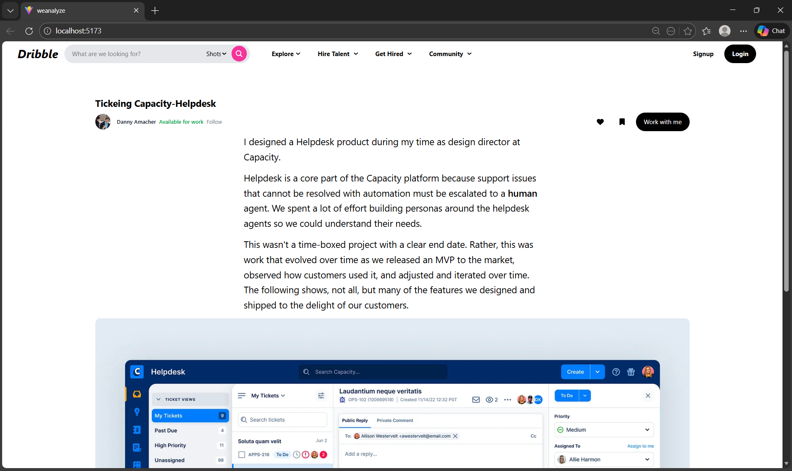

# WeAnalyze Assignment

A frontend React project built with Vite as part of the WeAnalyze assignment.  
This repository contains a responsive user interface with a sticky navigation layout, user bar, and image content display.

## 🧠 Project Overview

This application includes:

- A **sticky top navigation bar** (`Navbar2`) with search & menu options  
- A **sticky user profile bar** (`Userbar`) just below the navbar  
- An **image container** to render artwork or visuals  
- Tailwind CSS for utility‑first styling  
- React icons for UI elements

> This layout ensures both the header and user info remain visible on scroll.

## 🚀 Tech Stack

- **React** (JSX components)  
- **Vite** (fast frontend tooling)  
- **Tailwind CSS** (styling)  
- **React Icons** (UI icons)  
- **JavaScript / HTML / CSS**

## 📦 Project Structure

    ├── src/
    │ ├── components/
    │ │ ├── Navbar2.jsx
    │ │ ├── Userbar.jsx
    │ │ ├── ImageContainer.jsx
    │ │ └── ...
    │ ├── App.jsx
    │ ├── index.js
    ├── index.html
    ├── package.json
    ├── vite.config.js
    └── tailwind.config.js

# Screeshot

